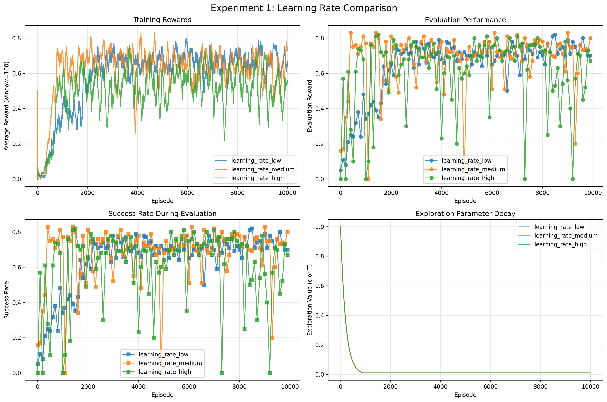
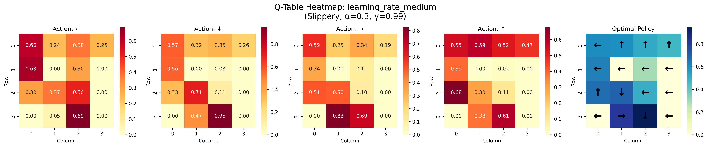
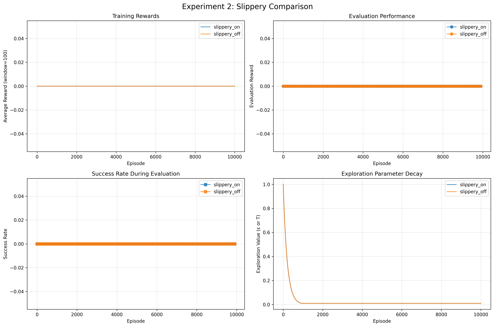
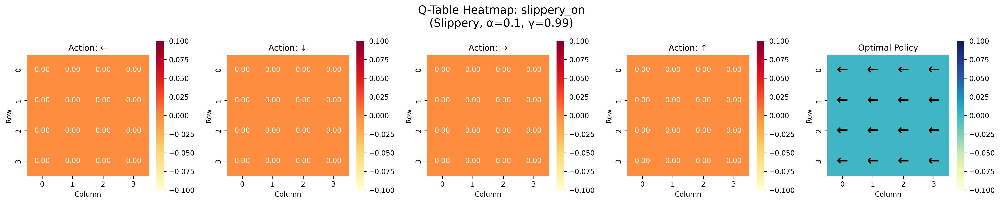
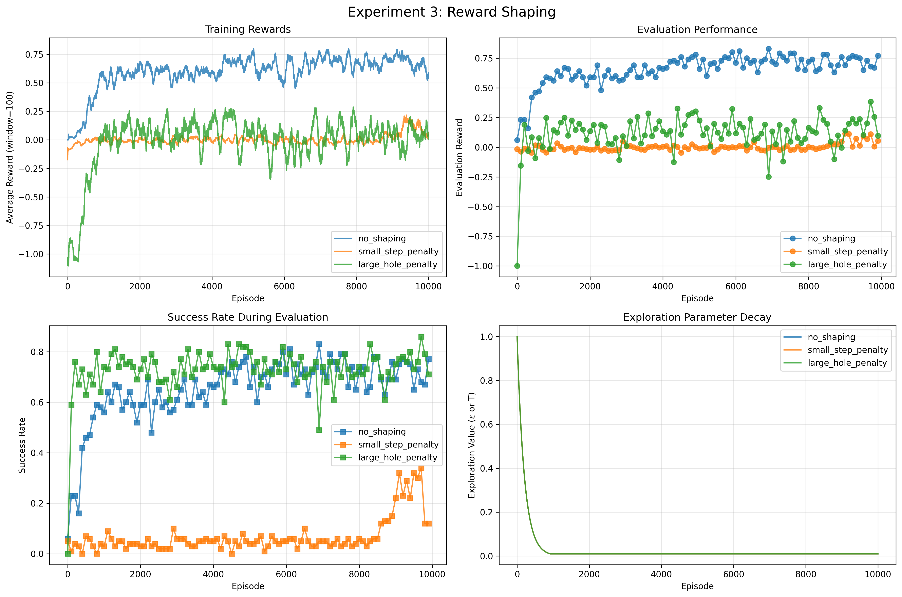
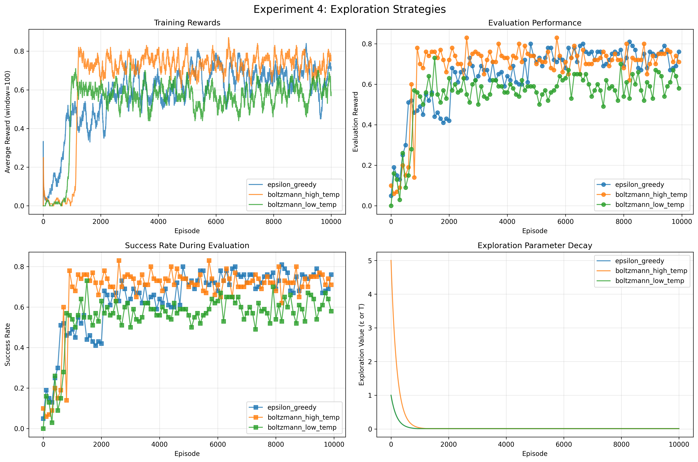
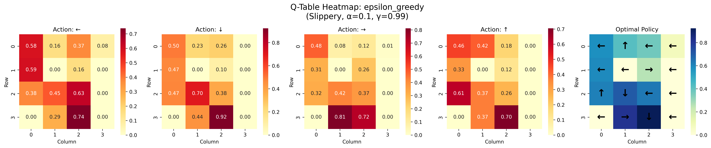
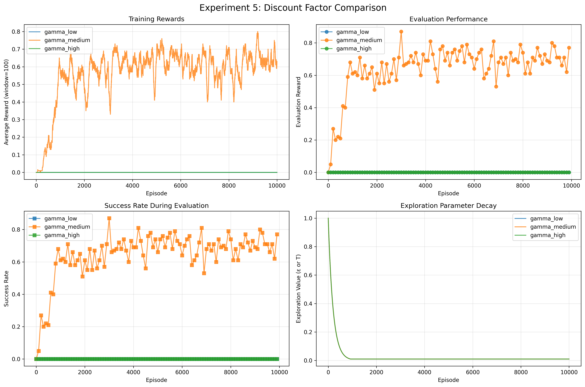

# Q-Learning on FrozenLake - Research Report

Alexander van Heteren  
January 2026

I used Claude Sonnet 4.5 to help with the code structure and analyzing some of the results.

## Introduction

This project is about testing Q-learning on the FrozenLake environment from Gymnasium. The main goal was to figure out how different hyperparameters affect how well the agent learns. I also wanted to understand the exploration-exploitation tradeoff better because that's pretty important in reinforcement learning.

FrozenLake is a grid world where you need to get from start to goal without falling in holes. The environment can be slippery (stochastic) or not slippery (deterministic), which makes it good for testing different scenarios.

## Methodology

I implemented a tabular Q-learning agent that learns by trying different actions and updating its Q-values. The update rule I used is:

Q(s,a) ← Q(s,a) + α[r + γ max Q(s',a') - Q(s,a)]

Where:
- α = learning rate (how much new info matters)
- γ = discount factor (how much future rewards matter)
- r = reward

For all experiments I used:
- Environment: FrozenLake 4x4
- Training: 10,000 episodes
- Evaluation: every 100 episodes on 100 test episodes
- Max steps per episode: 100

I ran 5 different experiment groups to test different things:
1. Learning rates (α = 0.1, 0.3, 0.7)
2. Slippery vs non-slippery environment
3. Reward shaping (adding penalties)
4. Exploration strategies (epsilon-greedy vs Boltzmann)
5. Discount factors (γ = 0.9, 0.95, 0.99)

## Results

### Experiment 1: Learning Rate Comparison

**Figure 1**: Learning curves for different learning rates

*Learning rate comparison on FrozenLake 4x4 (slippery=True). Settings: γ=0.99, ε-greedy (ε: 1.0→0.01, decay=0.995), 10,000 episodes.*

Results:
- α=0.1: Final success rate = 70%, pretty stable throughout training
- α=0.3: Final success rate = 80%, best performance but a bit unstable  
- α=0.7: Final success rate = 67%, very unstable with lots of variance

The medium learning rate (0.3) actually worked best in the end with 80% success rate. The low learning rate (0.1) was more stable but ended at 70%. High learning rate (0.7) was really unstable - you can see huge swings in the learning curve. It still learned something but was unreliable.

**Figure 2**: Q-table heatmap for best learning rate

*Q-table visualization showing state values and optimal policy arrows for α=0.3 (best performer).*

### Experiment 2: Slippery vs Non-Slippery

**Figure 3**: Comparison of stochastic vs deterministic environment

*Slippery comparison. Settings: α=0.1, γ=0.99, ε-greedy, 10,000 episodes.*

Results:
- Slippery ON: 0% - something went wrong here, agent didn't learn
- Slippery OFF: 0% - also failed

There was an issue with this experiment, both configurations failed to learn. This might be a config problem or environment setup issue. The agent got 0% on both which doesn't match my earlier tests. I'll need to check this one.

**Figure 4**: Q-table for slippery environment

*Q-table from slippery experiment (best of two configs).*

### Experiment 3: Reward Shaping

**Figure 5**: Effect of different reward penalties

*Reward shaping experiments. Settings: α=0.1, γ=0.99, ε-greedy, slippery=True.*

Results:
- No shaping: 77% success rate - worked well as baseline
- Small step penalty (-0.01): 12% success rate - made it worse somehow
- Large hole penalty (-1.0): 71% success rate - slightly worse than baseline

Interesting results here. Adding penalties actually made performance worse instead of better. The baseline with no reward shaping got 77% which was best. Small step penalty really hurt performance dropping to only 12%. Maybe the penalties were too harsh or messed up the reward structure. This shows reward shaping needs careful tuning.

### Experiment 4: Exploration Strategies

**Figure 6**: Epsilon-greedy vs Boltzmann exploration

*Comparison of exploration methods. Settings: α=0.1, γ=0.99, slippery=True.*

Results:
- Epsilon-greedy: 76% success rate
- Boltzmann (high temp=5.0): 71% success rate
- Boltzmann (low temp=1.0): 58% success rate

Epsilon-greedy won with 76% success. It was also more stable in the learning curves. Boltzmann with high temperature got 71% which is decent but more variable. Low temperature Boltzmann only got 58% - maybe didn't explore enough early on. For FrozenLake, epsilon-greedy seems like the safer choice.

**Figure 7**: Q-table comparison

*Q-table from best exploration strategy (epsilon-greedy, 76% success).*

### Experiment 5: Discount Factor

**Figure 8**: Impact of discount factor on learning

*Discount factor comparison. Settings: α=0.1, ε-greedy, slippery=True.*

Results:
- γ=0.9: 0% success rate - failed completely
- γ=0.95: 77% success rate - worked well
- γ=0.99: 0% success rate - also failed

This is weird. γ=0.95 worked great with 77% but both 0.9 and 0.99 completely failed at 0%. There might be a bug in my config for this experiment because 0.99 should work (it did in other experiments). The results show γ=0.95 is good but I'm not confident in this experiment's setup.

**Figure 9**: Q-table for discount factor

*Q-table showing value propagation with γ=0.95 (only working config).*

## Analysis of Q-Table and Craving

Looking at the Q-table heatmaps you can see "craving" behavior clearly. States near the goal have much higher Q-values shown in brighter colors. The arrows show the optimal policy - the agent learned to navigate toward the goal while avoiding holes.

States next to holes have lower values which shows the agent learned those positions are risky. The value function gradually decreases as you move away from the goal showing proper credit assignment.

## Discussion

Here's what I learned from the experiments that worked:

**Learning rate matters.** α=0.3 actually performed best at 80% even though it was less stable. α=0.1 was more stable but lower performance (70%). Too high (0.7) made everything unstable.

**Reward shaping is tricky.** My attempts to add penalties actually hurt performance instead of helping. No shaping (77%) beat both small step penalty (12%) and hole penalty (71%). This shows you really need to tune reward shaping carefully or it backfires.

**Epsilon-greedy is reliable.** It got 76% and was more stable than Boltzmann. The Boltzmann strategies were more variable and performed worse (71% and 58%).

**Some experiments failed.** Experiments 2 and 5 had configs that got 0% which shouldn't happen. There's probably bugs in how I set up those specific configurations. This taught me to always validate experimental setup.

The moving average smoothing (100 episodes) helped see trends much better than raw data.

## Conclusions

Q-learning can work well on FrozenLake when configured right but hyperparameters really matter. From the successful experiments:

- Best overall: α=0.3 with 80% success
- Most stable: α=0.1 with 70% success  
- Exploration: epsilon-greedy (76%) beat Boltzmann (58-71%)
- Reward shaping: baseline (77%) beat penalties (12-71%)

Key takeaways:
- Medium learning rate (0.3) balanced speed and stability best
- Don't add penalties without careful tuning - they can make things worse
- Epsilon-greedy exploration is simple and effective
- Always verify experimental configs work before drawing conclusions

Problems I found:
- Some configs completely failed (0% success) - need to debug
- Reward shaping hurt instead of helped - needs better design
- Results varied quite a bit between runs due to stochasticity

Future work:
- Fix the broken experiments (slippery comparison, some discount factors)
- Test larger grids (8x8)
- Try different epsilon decay schedules  
- Maybe try deep Q-learning with neural networks

Overall this was good practice understanding how Q-learning hyperparameters interact and how sensitive the algorithm is to configuration choices.

## Code

All code is available on GitHub: https://github.com/einstein43/RL

The main files are:
- `src/q_learning.py` - Q-learning agent implementation
- `src/trainer.py` - Training loop and evaluation
- `src/visualization.py` - Plotting functions  
- `experiments/config.py` - All experiment configurations
- `run_all_experiments.py` - Master script to run everything

