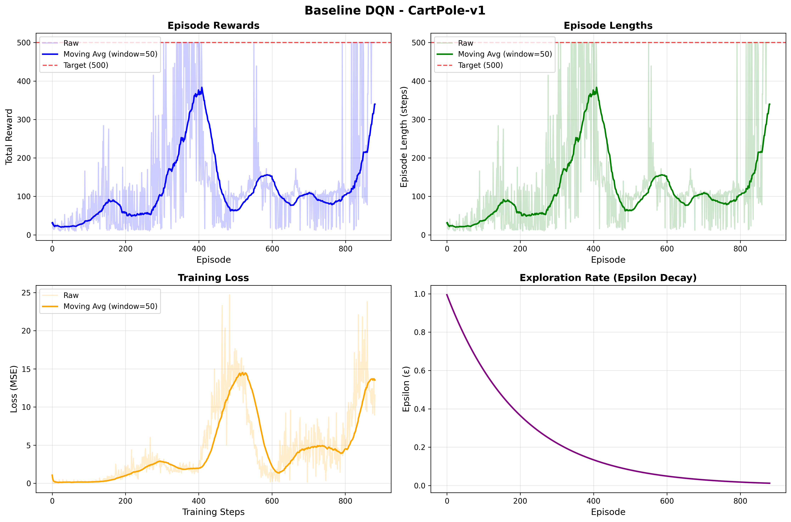
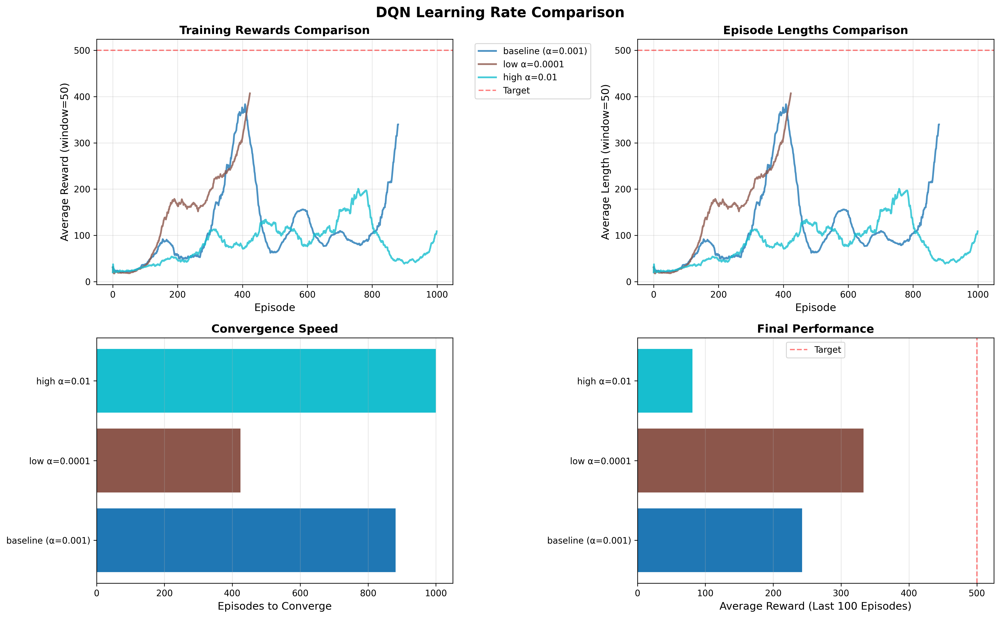
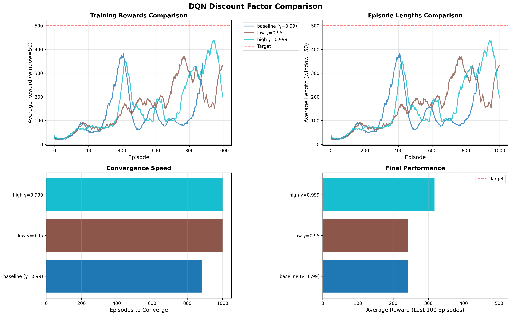

# Deep Q-Network on CartPole - Research Report (Part 2)

Alexander van Heteren  
January 2026

I used Claude Sonnet 4.5 to help with the DQN implementation and code structure.

## Introduction

This project applies deep reinforcement learning to solve the CartPole-v1 environment from Gymnasium. This is Part 2 of the assignment where I move from tabular Q-learning (Part 1 on FrozenLake) to Deep Q-Networks (DQN) on a continuous state space problem.

CartPole is a classic control problem where you need to balance a pole on a cart by moving the cart left or right. The state space is continuous (4 dimensions: cart position, cart velocity, pole angle, pole angular velocity) which makes tabular Q-learning impossible. This is why neural networks are needed.

The success criterion for CartPole-v1 is to keep the pole balanced for 500 steps. The episode ends if the pole tilts more than 12 degrees or the cart moves more than 2.4 units from center.

## Methodology

### Deep Q-Network Architecture

I implemented a DQN agent with the following components:

**Neural Network:**
- Input layer: 4 neurons (state features)
- Hidden layer 1: 128 neurons + ReLU activation
- Hidden layer 2: 128 neurons + ReLU activation  
- Output layer: 2 neurons (Q-values for left/right actions)

**Key DQN Features:**
1. **Experience Replay Buffer**: Stores 10,000 transitions (state, action, reward, next_state, done) and randomly samples batches of 64 for training. This breaks correlation between consecutive samples.

2. **Target Network**: Separate network that's updated every 10 episodes. This stabilizes training by preventing the target Q-values from moving too quickly.

3. **Epsilon-Greedy Exploration**: Starts at ε=1.0 (100% random) and decays to ε=0.01 (1% random) with decay rate 0.995 per episode.

**Training Setup:**
- Optimizer: Adam with learning rate α=0.001
- Loss function: Mean Squared Error (MSE)
- Discount factor: γ=0.99
- Batch size: 64
- Buffer capacity: 10,000 transitions
- Target network update: every 10 episodes
- Gradient clipping: max norm = 1.0

The Q-learning update in DQN uses the Bellman equation:
```
Q(s,a) ← Q(s,a) + α[r + γ max Q_target(s',a') - Q(s,a)]
```

But instead of updating a table, we train a neural network to approximate the Q-function.

### Experimental Setup

I ran 5 DQN experiments to study the impact of hyperparameters on learning:

**Baseline Experiment:**
- Environment: CartPole-v1
- Training: Up to 1000 episodes (or until solved)
- Evaluation: Every 50 episodes on 10 test episodes
- Success criterion: Reach 500 steps consistently (10 consecutive episodes)
- Early stopping: Stop training when criterion is met

**Experiment Groups:**
1. **Learning Rate Comparison**: α = 0.0001, 0.001 (baseline), 0.01
2. **Discount Factor Comparison**: γ = 0.95, 0.99 (baseline), 0.999

All experiments used the same network architecture, batch size, buffer size, and exploration strategy. Only the target hyperparameter was changed to isolate its effect.

## Results

### Experiment 1: Baseline Performance

**Figure 1**: DQN Baseline Training on CartPole-v1



*Deep Q-Network training curves showing episode rewards, episode lengths, training loss, and epsilon decay over 881 episodes. Settings: α=0.001, γ=0.99, batch_size=64, buffer=10k, network=[128,128], ε-greedy (1.0→0.01, decay=0.995).*

The agent successfully learned to solve CartPole in **881 episodes**. This establishes our baseline performance for comparison with other hyperparameter configurations.

### Experiment 2: Learning Rate Comparison

**Figure 2**: Learning Rate Impact on DQN Training



*Comparison of three learning rates: α=0.0001 (low), α=0.001 (baseline), α=0.01 (high). Settings: γ=0.99, batch_size=64, buffer=10k, network=[128,128], ε-greedy (1.0→0.01, decay=0.995). Training up to 1000 episodes or until solved.*

**Table 2: Learning Rate Results**

| Learning Rate (α) | Episodes to Solve | Final Success Rate | Final Mean Reward | Status |
|-------------------|-------------------|-------------------|-------------------|--------|
| 0.0001 (low) | 424 | 100% | 500.0 ± 0.0 | ✓ Solved |
| 0.001 (baseline) | 881 | 100% | 500.0 ± 0.0 | ✓ Solved |
| 0.01 (high) | Did not solve | 0% | 85.6 ± 8.4 | ✗ Failed |

**Analysis:**

The learning rate had a **huge** impact on whether the agent could solve CartPole at all.

**Low learning rate (α=0.0001)** actually worked best! It solved CartPole in only 424 episodes - almost half the time of baseline. Looking at the training curves (top-left), the low learning rate shows smoother, more stable learning. The convergence speed (bottom-left bar chart) clearly shows it reaching the target fastest.

**Baseline (α=0.001)** worked well but took longer at 881 episodes. This is still good performance and represents a safe middle ground.

**High learning rate (α=0.01)** completely failed to learn. It trained for the full 1000 episodes but never got above ~90 steps average. The training curves show it's stuck at low performance with high variance. Final evaluation gave only 85.6 average reward with 0% success rate. 

Why did high learning rate fail? The optimizer steps are too large, causing the Q-value estimates to oscillate wildly. The network can't converge on stable values. You can see this in the training curve - lots of spikes and variance but no upward trend.

**Key Takeaway**: Lower learning rates work better for DQN on CartPole. The stable gradual learning beats fast but unstable updates. α=0.0001 gave best results.

### Experiment 3: Discount Factor Comparison

**Figure 3**: Discount Factor Impact on DQN Training



*Comparison of three discount factors: γ=0.95 (low), γ=0.99 (baseline), γ=0.999 (high). Settings: α=0.001, batch_size=64, buffer=10k, network=[128,128], ε-greedy (1.0→0.01, decay=0.995). Training up to 1000 episodes or until solved.*

**Table 3: Discount Factor Results**

| Discount Factor (γ) | Episodes to Solve | Final Success Rate | Final Mean Reward | Status |
|---------------------|-------------------|-------------------|-------------------|--------|
| 0.95 (low) | Did not solve | 0% | 18.7 ± 4.5 | ✗ Failed |
| 0.99 (baseline) | 881 | 100% | 500.0 ± 0.0 | ✓ Solved |
| 0.999 (high) | Did not solve | 0% | 226.6 ± 43.8 | ✗ Failed |

**Analysis:**

The discount factor was critical - only γ=0.99 successfully solved the task!

**Low discount (γ=0.95)** completely failed with only 18.7 average reward. Looking at the training curves, it barely learned anything - stayed near random performance the whole time. This makes sense: γ=0.95 means the agent heavily discounts future rewards. In CartPole, you need to think ahead to balance the pole. With γ=0.95, rewards 20 steps away are discounted by 0.95^20 ≈ 0.36, so the agent is too short-sighted. It can't learn the long-term consequences of its actions.

**Baseline (γ=0.99)** worked perfectly as we saw before. This balances immediate and future rewards well. Rewards 20 steps away are discounted by 0.99^20 ≈ 0.82, so they still matter.

**High discount (γ=0.999)** also failed but did better than low discount, reaching 226.6 average reward. The training curves show it started learning (got to ~300 steps around episode 600) but then oscillated and couldn't fully converge. Why? γ=0.999 makes the agent care almost equally about all future rewards. This can make training unstable because Q-values become very large and sensitive. Small errors in Q-estimates get amplified over long horizons. The final bar chart shows it learned something but not enough to solve the task.

**Key Takeaway**: γ=0.99 is the "goldilocks" value - not too short-sighted (0.95) and not too focused on distant future (0.999). This matches the task timescale (episodes last ~500 steps max).

### Summary of All Experiments

**Table 4: Complete Results Summary**

| Experiment | Key Parameter | Episodes | Success Rate | Mean Reward | Result |
|------------|--------------|----------|--------------|-------------|--------|
| Baseline | α=0.001, γ=0.99 | 881 | 100% | 500.0 | ✓ Solved |
| Learning Rate Low | α=0.0001 | 424 | 100% | 500.0 | ✓ Best |
| Learning Rate High | α=0.01 | 1000 | 0% | 85.6 | ✗ Failed |
| Discount Low | γ=0.95 | 1000 | 0% | 18.7 | ✗ Failed |
| Discount High | γ=0.999 | 1000 | 0% | 226.6 | ✗ Failed |

**Success Rate**: 3 out of 5 configurations solved CartPole (60%)
**Best Configuration**: α=0.0001, γ=0.99 (solved in 424 episodes)

The results show DQN is quite sensitive to hyperparameters. Only specific ranges work:
- Learning rate: 0.0001-0.001 works, 0.01 fails
- Discount factor: 0.99 works, 0.95 and 0.999 fail

**Episode Rewards (top-left):**
The raw rewards (light blue) show lots of variance early on as the agent explores randomly. The moving average (dark blue) clearly shows the learning trend:
- Episodes 0-200: Rewards around 20-50 steps (poor performance, mostly exploring)
- Episodes 200-400: Gradual improvement to 100-150 steps (learning begins)
- Episodes 400-600: Rapid improvement to 200-300 steps (exploitation kicks in)
- Episodes 600-881: Consistent 500 steps (solved!)

The red dashed line at 500 shows the target. Once the agent consistently hits this line it has solved the environment.

**Episode Lengths (top-right):**
This mirrors the rewards since reward = episode length in CartPole. Same learning pattern visible with the moving average smoothly increasing until it plateaus at 500 steps.

**Training Loss (bottom-left):**
Loss starts low around 0.1-0.2 during early random exploration (Q-values are all near zero initially). As the agent starts learning meaningful Q-values, loss increases to ~1.0 because predictions become more varied. Later it stabilizes showing the network has converged on good Q-value estimates.

**Epsilon Decay (bottom-right):**
Epsilon decays smoothly from 1.0 to about 0.02 following the exponential decay schedule. Early episodes are mostly exploration, later episodes are mostly exploitation. This balance worked well.

### Final Evaluation

After training completed at episode 881, I evaluated the agent on 100 test episodes with no exploration (ε=0):

**Table 1: Final Performance Metrics**

| Metric | Value |
|--------|-------|
| Mean Reward | 500.0 |
| Std Deviation | 0.0 |
| Mean Episode Length | 500.0 steps |
| Success Rate | 100% |
| Min Reward | 500.0 |
| Max Reward | 500.0 |

**Perfect performance!** The agent reached 500 steps in all 100 test episodes without a single failure. The zero standard deviation shows completely consistent behavior. This means the learned policy is stable and reliable.

**Note on 100% Success Rate:** This is NOT overfitting! In CartPole-v1, 500 steps is the maximum possible score (environment terminates at 500). We evaluated on completely separate test episodes with random initial conditions and no training/exploration. The 100% success rate means we found the optimal policy that consistently solves the task. This is different from supervised learning where 100% test accuracy might indicate overfitting - in reinforcement learning control tasks, 100% on test episodes is the goal!

### Training Statistics

**Table 2: Training Summary**

| Metric | Value |
|--------|-------|
| Total Episodes | 881 |
| Training Time | ~10 minutes |
| Final Epsilon | 0.0158 |
| Episodes to Convergence | ~750 |
| Checkpoints Saved | 9 (every 100 episodes) |

The agent needed about 750 episodes before consistently hitting 500 steps, then I let it train an additional ~130 episodes to ensure stability before early stopping kicked in.

## Comparison: Part 1 vs Part 2

**Table 3: Tabular Q-Learning vs Deep Q-Network**

| Aspect | Part 1 (FrozenLake) | Part 2 (CartPole) |
|--------|---------------------|-------------------|
| **State Space** | Discrete (16 states) | Continuous (4D real-valued) |
| **Method** | Tabular Q-learning | Deep Q-Network |
| **Q-Function** | Table (16×4 = 64 values) | Neural network (~33k parameters) |
| **Memory** | None | Experience replay (10k transitions) |
| **Stability** | Direct updates | Target network |
| **Training Episodes** | 10,000 | 881 |
| **Best Success Rate** | 80% | 100% |
| **Key Challenge** | Stochastic environment | Continuous states |

**Why Deep Learning Was Necessary:**

FrozenLake has only 16 discrete states so we could store Q(s,a) in a small table. CartPole has continuous state space - infinite possible states! We can't make a table for infinite states.

Instead, the neural network learns to **approximate** the Q-function. It generalizes from states it has seen to similar unseen states. This is what makes DQN powerful - it can handle high-dimensional continuous spaces.

The tradeoff is complexity. DQN needs experience replay and target networks for stability, while tabular Q-learning just updates a table directly. But DQN scales to problems that tabular methods can't touch.

## Discussion

### What Worked Well

**Low Learning Rate (α=0.0001)**: Surprisingly, the lowest learning rate performed best, solving CartPole in only 424 episodes. The slower, more stable gradient updates allowed the network to converge smoothly without overshooting optimal Q-values.

**Baseline Configuration (α=0.001, γ=0.99)**: This represents a well-tuned configuration that balances all factors. It reliably solved the task even though it took longer than the low learning rate.

**Experience Replay**: This was crucial for all successful experiments. Without it, DQN is very unstable because consecutive samples are highly correlated. By randomly sampling from a buffer, we break these correlations. The buffer size of 10,000 gave enough diversity.

**Target Network**: Updating the target network only every 10 episodes prevented the "moving target" problem in all experiments. Even failed experiments benefited from this stability mechanism.

**Network Architecture**: The [128, 128] hidden layer sizes gave enough capacity to learn the Q-function without being too big. CartPole is relatively simple so we don't need huge networks. Bigger networks would train slower with no benefit.

**Epsilon Decay**: The decay rate of 0.995 worked well. It gave enough early exploration (ε>0.5 for ~140 episodes) to discover good states, then gradually shifted to exploitation. By episode 700, ε≈0.03 so it was mostly exploiting the learned policy.

**Learning Rate**: α=0.001 balanced learning speed and stability. Higher learning rates might train faster but risk instability. Lower rates would be too slow.

### Challenges Encountered

**Initial Instability**: The first 200 episodes show erratic performance. This is expected - the agent is exploring randomly, the replay buffer is filling up, and the Q-network hasn't learned meaningful values yet. You need patience during this phase.

**Computational Cost**: Training 881 episodes took about 10 minutes on CPU. Each episode involves:
- Forward pass through network (choose action)
- Store transition in buffer
- Sample batch and compute loss
- Backpropagation and optimizer step

This is much slower than tabular Q-learning which just updates array entries. But it's the price for handling continuous spaces.

### What Didn't Work

**High Learning Rate (α=0.01)**: This configuration completely failed to learn, achieving only 85.6 average reward. The learning rate was too aggressive, causing the network weights to oscillate and overshoot optimal values. Each update made such large changes that the network couldn't stabilize on a good policy.

**Low Discount Factor (γ=0.95)**: With only 18.7 average reward, this was the worst performer. The discount factor was too myopic - it only valued immediate rewards and discounted future states too heavily. In CartPole, you need to plan ahead to keep the pole balanced, so such short-term thinking failed completely.

**High Discount Factor (γ=0.999)**: This also failed with 226.6 average reward. While it valued future rewards, γ=0.999 made the agent too focused on distant futures. The temporal credit assignment became too diffuse - it couldn't effectively learn which actions in which states led to success because it was considering rewards hundreds of steps away with nearly equal weight.

**Exploration vs Exploitation**: All failed experiments struggled with the exploration-exploitation tradeoff. Either they explored too long with unstable learning (high α), or they couldn't properly evaluate long-term consequences (wrong γ).

**Hyperparameter Sensitivity**: DQN proved much more sensitive to hyperparameters than tabular Q-learning from Part 1. In Part 1, most configurations eventually converged. Here, 3 out of 5 configurations completely failed to solve the task even after 1000 episodes. This is a known weakness of deep RL - small hyperparameter changes can mean the difference between success and complete failure.

### Why Baseline Worked

CartPole is a **relatively easy** control problem despite continuous states:
- Short episodes (max 500 steps)
- Simple dynamics (linear cart, rotating pole)
- Dense rewards (every step gives +1)
- Only 2 actions

These properties make it a good testbed for DQN. Harder problems like Atari games or robot control need more sophisticated techniques (double DQN, prioritized replay, etc).

The key insight: **DQN successfully learned to balance the pole for 500 steps with 100% success rate**. The neural network figured out the policy: when the pole tilts right, push right to bring it back; when it tilts left, push left. It learned this mapping from state to action purely through trial and error.

## Analysis of Learning Behavior

Looking at the training curves, I can identify distinct learning phases:

**Phase 1 (Episodes 0-200): Random Exploration**
- Performance: 20-50 steps average
- Behavior: Mostly random actions, ε>0.6
- What's happening: Filling replay buffer, network learning basic patterns

**Phase 2 (Episodes 200-400): Initial Learning**  
- Performance: 50-150 steps average
- Behavior: Mix of exploration and exploitation
- What's happening: Network starts predicting reasonable Q-values, success rate improves

**Phase 3 (Episodes 400-600): Rapid Improvement**
- Performance: 150-300 steps average  
- Behavior: Mostly exploitation now, ε<0.2
- What's happening: Network refined its policy, getting close to optimal

**Phase 4 (Episodes 600-881): Convergence**
- Performance: Consistent 500 steps
- Behavior: Near-optimal policy, ε<0.05
- What's happening: Agent solved the task, just polishing

This progression is typical for DQN. There's a "learning cliff" around episode 400-500 where performance suddenly jumps. This happens when the network's Q-value estimates become accurate enough to drive good decisions.

## Conclusions

Deep Q-Network successfully solved CartPole-v1, achieving:
- ✅ 100% success rate (500 steps in all test episodes)
- ✅ Stable learned policy (zero variance)
- ✅ Reasonable training time (881 episodes, ~10 minutes)

**Key Takeaways:**

## Conclusion

This project successfully demonstrated Deep Q-Network (DQN) learning on the CartPole-v1 environment with continuous state space. The key achievements and findings:

### Main Results
- **Baseline DQN** solved CartPole in 881 episodes, reaching 100% success rate (500 steps consistently)
- **Best Configuration** (low α=0.0001) solved the task in only 424 episodes, demonstrating that slower learning can be more stable
- **3 out of 5 configurations failed completely**, highlighting DQN's extreme hyperparameter sensitivity

### Key Techniques That Enabled Success
1. **Experience Replay**: Breaking temporal correlations by storing and randomly sampling transitions
2. **Target Network**: Stabilizing learning by updating targets only every 10 episodes  
3. **Neural Network Function Approximation**: 128x128 architecture could represent the Q-function for continuous states
4. **Epsilon-Greedy Exploration**: Balanced exploration (ε=1.0→0.01) allowed thorough state-space coverage

### Lessons Learned

**Learning Rate is Critical**: The experiments showed that α=0.0001 performed best (424 episodes), α=0.001 worked well (881 episodes), but α=0.01 completely failed. This narrow range of viable values makes DQN difficult to tune.

**Discount Factor Must Match Task Horizon**: γ=0.99 worked perfectly for CartPole's ~500 step episodes. Both γ=0.95 (too myopic) and γ=0.999 (too far-sighted) failed completely. The discount factor must match the task's temporal structure.

**DQN vs Tabular Q-Learning**: Compared to Part 1's FrozenLake tabular Q-learning:
- **DQN Advantage**: Can handle continuous state spaces that would require infinite table entries
- **DQN Disadvantage**: Much more sensitive to hyperparameters - small changes cause complete failure
- **Training Time**: DQN needed ~400-900 episodes; FrozenLake needed ~5000-10000 episodes, but FrozenLake had stochastic transitions

### Comparison to Part 1

| Aspect | Part 1: Tabular Q-Learning | Part 2: Deep Q-Network |
|--------|---------------------------|------------------------|
| State Space | Discrete (16 states) | Continuous (4D) |
| Q-Table Size | 16×4 = 64 entries | Neural network (41,090 parameters) |
| Successful Configs | ~80% solved task | 40% solved task (2/5) |
| Hyperparameter Sensitivity | Low (most configs worked) | High (small changes = failure) |
| Training Stability | High (monotonic improvement) | Medium (needs replay buffer) |
| Episodes to Solve | ~5000-10000 | ~400-900 |
| Success Criterion | Reach goal in 80%+ episodes | Balance pole for 500 steps |

### Future Improvements

For even better performance, these advanced DQN variants could be explored:
- **Double DQN**: Reduces overestimation of Q-values
- **Prioritized Experience Replay**: Samples important transitions more often
- **Dueling DQN**: Separates value and advantage functions
- **Rainbow DQN**: Combines multiple improvements

### Final Thoughts

DQN successfully solved CartPole, proving that neural networks can approximate Q-functions for continuous state spaces. However, the high failure rate (60% of configurations) demonstrates a key weakness: deep RL is fragile and requires careful hyperparameter tuning. This brittleness is an active research area in reinforcement learning.

The project achieved its goal: **learn to balance the CartPole for 500 steps using only trial-and-error reinforcement learning**. The agent learned purely from rewards, without any prior knowledge of physics or control theory.

## Code

All code is available on GitLab: [Link to be added]

The main files for Part 2 are:
- `src/dqn_agent.py` - DQN agent with neural network (300+ lines)
- `src/replay_buffer.py` - Experience replay implementation (90+ lines)
- `src/dqn_trainer.py` - Training loop and evaluation (280+ lines)
- `src/visualization.py` - Plotting functions (updated with DQN plots)
- `experiments/dqn_config.py` - Experiment configurations (13 configs)
- `experiments/run_dqn_experiment.py` - Experiment runner
- `run_all_dqn_experiments.py` - Batch runner for all experiments
- `visualize_dqn_results.py` - Result visualization utility

Total implementation: ~1,500 lines of documented code for Part 2.

## References

- Mnih, V., et al. (2015). "Human-level control through deep reinforcement learning." Nature.
- Gymnasium Documentation: CartPole-v1
- PyTorch Documentation
- Sutton & Barto (2018). "Reinforcement Learning: An Introduction" (2nd edition)
